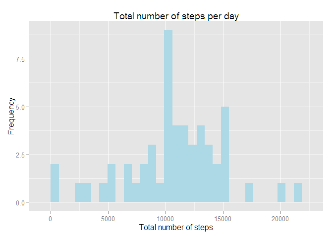
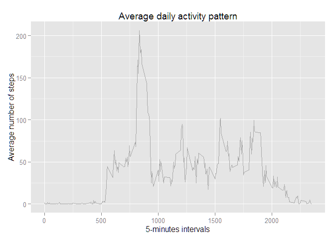
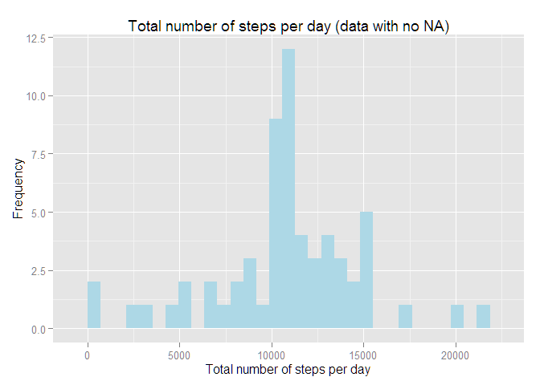
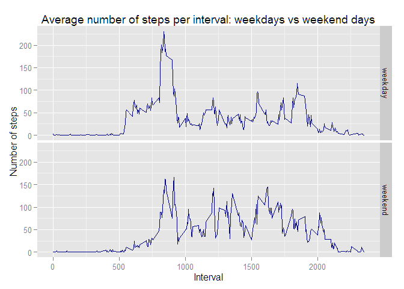

# Reproducible Research: Peer Assessment 1

##Global settings


```r
#Show code
echo = TRUE

#Load packages
require(ggplot2)
require(dplyr)

#Set path to my directory (replace the path by yours and uncomment the line)
#setwd(dir = "./01JHU/5-ReproducibleResearch/RepData_PeerAssessment1") 
```
    
## Loading and preprocessing the data

*1. Load the data (i.e. read.csv())*

*2. Process/transform the data (if necessary) into a format suitable for your analysis*


```r
#Download and unzip file, in case it is not present in the folder.
if (!file.exists ("activity.zip")) {
        download.file(url = "https://d396qusza40orc.cloudfront.net/repdata%2Fdata%2Factivity.zip", destfile = "./activity.zip")
}

if (!file.exists("activity.csv")) {
        unzip(zipfile = "./activity.zip")
}

#Read and load the data
activity <- read.csv(file = "./activity.csv", colClasses = c("integer", "Date", "numeric"))
```
    

## What is mean total number of steps taken per day?

*1. Calculate the total number of steps taken per day*


```r
#Calculate the total number of steps taken per day
steps.day <- summarize(group_by(na.omit(activity), by = date), sum(steps))
colnames(steps.day) <- c("date", "steps")
```

*2. Make a histogram of the total number of steps taken each day*


```r
#Plot an histogram of the total number of steps per day
g.steps <- ggplot(data = steps.day, aes(x = steps)) +
        geom_histogram(fill = "lightblue") +
        xlab("Total number of steps") + ylab("Frequency") +
        ggtitle("Total number of steps per day")
print(g.steps)
```

 

*3. Calculate and report the mean and median of the total number of steps taken per day*

```r
#Calculate the mean number of steps per day
mn <- mean(steps.day$steps)

#Calculate the median number of steps per day
med <- median(steps.day$steps)
```

- Mean number of steps taken per day: 1.0766\times 10^{4}
- Median number of steps taken per day: 10765

## What is the average daily activity pattern?

*1. Make a time series plot (i.e. type = "l") of the 5-minute interval (x-axis) and the average number of steps taken, averaged across all days (y-axis)*

```r
#Plots the time series plot
steps.interval <- summarize(group_by(na.omit(activity), by = interval), mean(steps))
colnames(steps.interval) <- c("interval", "avg.steps")
g.interval <- ggplot(data = steps.interval, aes(x = interval, y = avg.steps)) +
        geom_line(stat = "identity", colour = "darkgrey") +
        xlab("5-minutes intervals") + ylab("Average number of steps") +
        ggtitle("Average daily activity pattern")

print(g.interval)
```

 

*2. Which 5-minute interval, on average across all the days in the dataset, contains the maximum number of steps?*

```r
#Calculate the interval of max number of steps
mx <- steps.interval[which(steps.interval$avg.steps == max(steps.interval$avg.steps)), ]$interval
```
The answer is: 835

## Imputing missing values

*1. Calculate and report the total number of missing values in the dataset (i.e. the total number of rows with NAs)*

```r
#Calculate the number of missing values in the dataset
na <- nrow(activity[is.na(activity$steps), ])
```
There are 2304 missing values in the dataset.

*2. Devise a strategy for filling in all of the missing values in the dataset. The strategy does not need to be sophisticated. For example, you could use the mean/median for that day, or the mean for that 5-minute interval, etc.*

My strategy is to use the mean number of steps for the 5-minute interval. Therefore, I will replace all missing values by the mean value of the corresponding intervals.

*3. Create a new dataset that is equal to the original dataset but with the missing data filled in.*


```r
#Create the new data with no missing value
activity2 <- activity
for(i in 1:nrow(activity2)) {
        if (is.na(activity2$steps[i])) {
                activity2$steps[i] <- steps.interval[which(steps.interval$interval == activity2$interval[i]), ]$avg.steps
        }
}
```

*4. Make a histogram of the total number of steps taken each day. What is the impact of imputing missing data on the estimates of the total daily number of steps?*

- Histogram :


```r
#Create a new steps.day summary, with no NA
steps.day2 <- summarize(group_by(activity2, by = date), sum(steps))
colnames(steps.day2) <- c("date", "steps")

#Plot an histogram of the total number of steps per day, with no NA
g.steps2 <- ggplot(data = steps.day2, aes(x = steps)) +
        geom_histogram(fill = "lightblue") +
        xlab("Total number of steps per day") + ylab("Frequency") +
        ggtitle("Total number of steps per day (data with no NA)")
print(g.steps2)
```

 

- Calculate and report the mean and median total number of steps taken per day. 


```r
#Calculate the mean number of steps per day
mn2 <- mean(steps.day2$steps)

#Calculate the median number of steps per day
med2 <- median(steps.day2$steps)
```

Mean number of steps taken per day (data with no NA): 1.0766\times 10^{4}
Median number of steps taken per day (data with no NA): 1.0766189\times 10^{4}

- Do these values differ from the estimates from the first part of the assignment? What is the impact of imputing missing data on the estimates of the total daily number of steps?


```r
#Calculate the difference in mean number of steps per day
round(mn2 - mn, 2)
```

```
## [1] 0
```

```r
#Calculate the difference in median number of steps per day
round(med2 - med, 2)
```

```
## [1] 1.19
```

We can conclude that the means are similar whether we include or impute missing values, but that the median is slightly higher when we impute the missing values. In fact, when imputed, the median appears to be equal to the mean number of steps taken per day.


## Are there differences in activity patterns between weekdays and weekends?

*1. Create a new factor variable in the dataset with two levels - "weekday" and "weekend" indicating whether a given date is a weekday or weekend day.*


```r
#Create the new variable
activity2$day <- as.factor(weekdays(activity2$date))
levels(activity2$day) <- list(weekday = c("lundi", "mardi", "mercredi", "jeudi", "vendredi"),
                              weekend = c("samedi", "dimanche")) #sorry, I'm French!
head(activity2$day)
```

```
## [1] weekday weekday weekday weekday weekday weekday
## Levels: weekday weekend
```

*2. Make a panel plot containing a time series plot (i.e. type = "l") of the 5-minute interval (x-axis) and the average number of steps taken, averaged across all weekday days or weekend days (y-axis).*


```r
#Plot the panel plot
steps.int.day <- aggregate(steps ~ interval + day, data = activity2, FUN = mean)
g.steps.int.day <- ggplot(data = steps.int.day, aes(x = interval, y = steps)) +
        geom_line(colour="darkblue") +
        facet_grid(day ~ .) +
        ggtitle("Average number of steps per interval: weekdays vs weekend days") +
        ylab("Number of steps") + xlab("Interval")
print(g.steps.int.day)
```

 
